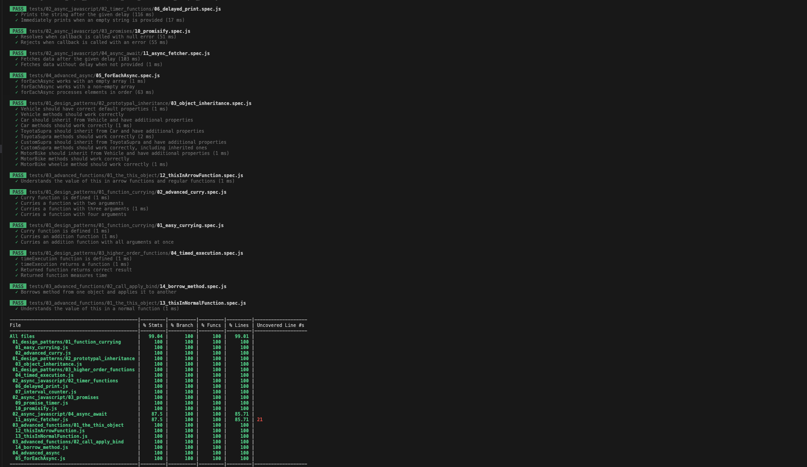

# TSD Academy - JavaScript Midlevel Action Item 🚀

In this exercise we will focus on `JavaScript Design Patterns` and `Asynchronous Programming`. 🛠️🧠


### Learning Objectives 🎯
1. Understand various `JavaScript Design Patterns`.
2. Master `Asynchronous JavaScript` programming.
3. Gain proficiency in `Test-Driven Development (TDD)`.

## Getting Started 🛠️

1. 📦 Clone this repository.
2. 📚 Run `npm install` to install dependencies.
3. 🧪 Run `npm test` to run the `Jest` tests.


⚠️⚠️⚠️ **We strongly advise against using AI tools like `GitHub Copilot` or `ChatGPT` to solve this Action Item! In most interviews, you will be asked to disable those.** ⚠️⚠️⚠️

📈 The code is covered in tests aiming for 99% test coverage, setting you up for TDD-style programming. Make sure all tests pass by the end of the exercise!

---

### 📋 Progress Sheet 

Legend:
1. 🟩 EASY - problems that are pretty much straightforward
2. 🟨 MEDIUM - a challenge for a mid-level dev
3. 🟥 HARD - harder problems that use advanced techniques


#### 🌟 01. JavaScript Design Patterns

- [ ] 🍛 **Function Currying**
    - [x] 🟩 EASY [01. Easy Currying](src/01_design_patterns/01_function_currying/01_easy_currying.js)
    - [ ] 🟥 HARD  [02. Advanced Curryin](src/01_design_patterns/01_function_currying/02_advanced_curry.js)

- [ ] 🏛️ **Prototypal Inheritance**
    - [ ] 🟩 EASY [03. Prototypal Inheritance](src/01_design_patterns/02_prototypal_inheritance/03_object_inheritance.js)

- [ ] 🔗 **Higher-Order Functions**
  - [ ] 🟨 MEDIUM [04. Timed Execution](src/01_design_patterns/03_higher_order_functions/04_timed_execution.js)

#### ⏳ 02. Asynchronous JavaScript

- [ ] 🔄 **Timer Functions**
  - [ ] 🟩 EASY [06. Delayed Print](src/02_async_javascript/02_timer_functions/06_delayed_print.js)
  - [ ] 🟨 MEDIUM [07. Interval Counter](src/02_async_javascript/02_timer_functions/07_interval_counter.js)
  

- [ ] 🔄 **Promises**
  - [ ] 🟨 MEDIUM [09. Promise Timer](src/02_async_javascript/03_promises/09_promise_timer.js)
  - [ ] 🟥 HARD [10. Promisify](src/02_async_javascript/03_promises/10_promisify.js)

- [ ] 🕒 **Async/Await**
  - [ ] 🟨 MEDIUM [11. Async Fetcher](src/02_async_javascript/04_async_await/11_async_fetcher.js)

#### 🔍 03. Advanced Functions

- [ ] 👁️ **The THIS Object**
  - [ ] 🟨 MEDIUM [12. `this` in `arrow functions`](src/03_advanced_functions/01_the_this_object/12_thisInArrowFunction.js)
  - [ ] 🟩 EASY [13. `this` in `normal functions`](src/03_advanced_functions/01_the_this_object/13_thisInNormalFunction.js)

- [ ] 📞 **Call / Apply / Bind**
  - [ ] 🟨 MEDIUM [14. Borrow Method](src/03_advanced_functions/02_call_apply_bind/14_borrow_method.js)

#### 🔍 04. Advanced Async
  - [ ]  🟥 HARD [15. `forEach` Async](src/04_advanced_async/05_forEachAsync.js)

---

## 📖 Problems Breakdown 🎯

### JavaScript Design Patterns

#### 01. Easy Currying
Understand the basics of function currying by completing this [exercise](src/01_design_patterns/01_function_currying/01_easy_currying.js). 

🧪 Run Tests: 
```bash
npm run test:watch 01_easy_currying
```

#### 02. Advanced Currying
Master advanced function currying in JavaScript. Try the [exercise](src/01_design_patterns/01_function_currying/02_advanced_curry.js). 

🧪 Run Tests: 
```bash
npm run test:watch 02_advanced_curry
```

---

#### 03. Prototypal Inheritance
Learn how inheritance works in JavaScript with this [exercise](src/01_design_patterns/02_prototypal_inheritance/03_object_inheritance.js). 

🧪 Run Test: 
```bash
npm run test:watch 03_object_inheritance
```

#### 04. Higher Order Function: Timed Execution
Learn to implement timed execution of functions. Get started with this [exercise](src/01_design_patterns/03_higher_order_functions/04_timed_execution.js). 

🧪 Run Tests: 
```bash
npm run test:watch 04_timed_execution
```

---

### Asynchronous JavaScript

#### 06. Delayed Print
Understand `setTimeout` through this [exercise](src/02_async_javascript/02_timer_functions/06_delayed_print.js). 

🧪 Run Tests: 
```bash
npm run test:watch 06_delayed_print
```

#### 07. Interval Counter
Learn how to use `setInterval` with this [exercise](src/02_async_javascript/02_timer_functions/07_interval_counter.js). 

🧪 Run Tests: 
```bash
npm run test:watch 07_interval_counter
```

#### 08. Auto Stop Counter
Master timers by making one that stops automatically in this [exercise](src/02_async_javascript/02_timer_functions/08_auto_stop_counter.js). 

🧪 Run Tests: 
```bash
npm run test:watch 08_auto_stop_counter
```

#### 09. Promise Timer
Get to grips with Promises by building a timer in this [exercise](src/02_async_javascript/03_promises/09_promise_timer.js). 

🧪 Run Tests: 
```bash
npm run test:watch 09_promise_timer
```

#### 10. Promisify
Learn how to convert callback-based functions to promises in this [exercise](src/02_async_javascript/03_promises/10_promisify.js). 

🧪 Run Tests: 
```bash
npm run test:watch 10_promisify
```

#### 11. Async Fetcher
Try using `async` and `await` for fetching data in this [exercise](src/02_async_javascript/04_async_await/11_async_fetcher.js). 

🧪 Run Tests: 
```bash
npm run test:watch 11_async_fetcher
```

---
### Advanced Functions

#### 12. `this` in `arrow functions`
Gain a deeper understanding of the `this` object in arrow functions with this [exercise](src/03_advanced_functions/01_the_this_object/12_thisInArrowFunction.js). 

🧪 Run Tests: 
```
npm run test:watch 12_thisInArrowFunction
```

#### 13. `this` in `normal functions`
Explore the behavior of `this` in standard functions in this [exercise](src/03_advanced_functions/02_call_apply_bind/13_thisInNormalFunction.js). 

🧪 Run Tests: 
```bash
npm run test:watch 13_thisInNormalFunction
```

#### 14. Borrow Method using Call
Master the `call` method by borrowing methods from other objects in this [exercise](src/03_advanced_functions/02_call_apply_bind/14_borrow_method.js). 

🧪 Run Tests: 
```bash
npm run test:watch 14_borrow_method
```

---


##### Getting Feedback & Help
If you have issues with the **Action Item**, you can ask for help in the [Community](https://www.skool.com/devmastery-academy-8041).

Made with ❤️ in Berlin by @TheSeniorDev
